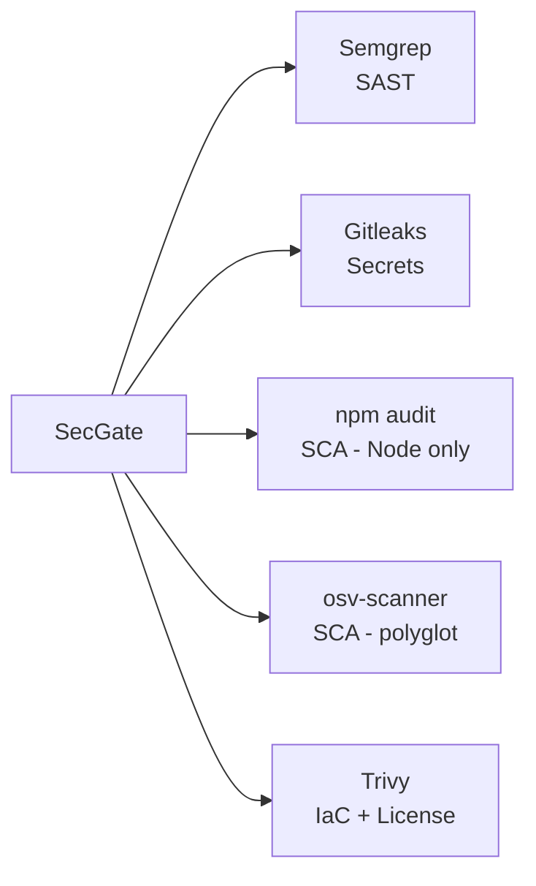

```text
░▒▓█ SECGATE · COVERAGE MATRIX █▓▒░
```

# Scanner Coverage Matrix

Which scanner covers which category — and where the gaps are.

---

## Summary

SecGate orchestrates five scanners spanning five categories. No single scanner covers all categories; the bundle is the product.



---

## Coverage Table

| Category | Scanner | Notes |
|----------|---------|-------|
| **SAST** (static code analysis) | Semgrep | Rule-based. Uses Semgrep's default OSS ruleset. Languages: Python, JS/TS, Go, Java, Ruby, PHP, C/C++, Rust, Scala, Kotlin, Swift. |
| **SCA — Node** (dependency CVE) | npm audit | Runs only when `package.json` is present. Uses npm's advisory DB via GitHub. |
| **SCA — polyglot** (multi-ecosystem CVE) | osv-scanner | npm, PyPI, Go modules, Cargo, Maven, RubyGems, Packagist, NuGet, Pub. Uses OSV.dev advisory DB. Overlaps with npm audit for Node — both run. |
| **Secrets** (credentials in code/history) | Gitleaks | Scans working tree by default. Extends to git history when `.git/` present. Redacts match bodies in output. |
| **IaC misconfiguration** | Trivy (`fs` mode) | Terraform, CloudFormation, Kubernetes manifests, Dockerfile, Helm, Ansible. Uses Trivy's default policy bundle. |
| **License** | Trivy (`fs` mode) | Detects package licenses and flags restricted (copyleft) licenses per Trivy defaults. |
| **Container image** | **Not covered today** — `trivy fs` reads Dockerfiles but does not scan built image layers. See [`#36`](https://github.com/tinydarkforge/SecGate/issues/36) for `trivy image` integration. |
| **DAST** (runtime testing) | Not covered — out of scope for a CI gate. |
| **Cloud posture (CSPM)** | Not covered — use cloud-native tools. |

---

## Overlap and Deduplication

Some categories have deliberate overlap for defense in depth:

- **Node dependencies** — both `npm audit` and `osv-scanner` run. They pull from different advisory sources (GitHub Advisories vs OSV.dev). Findings are surfaced separately per scanner in the report; deduplication by CVE ID is planned but not yet implemented.
- **Dockerfile** — Semgrep has Dockerfile rules; Trivy scans Dockerfile for misconfig. Different lenses (code smell vs policy), both kept.

---

## Explicit Gaps

Honesty matters. These are known limits of the current bundle.

### 1. Container image layers

`trivy fs` scans the filesystem — it reads `Dockerfile` as a text file but does **not** resolve base images, pull layers, or enumerate installed OS packages inside the image. For full container image scanning (apk/apt/yum package CVEs, layer-by-layer diff), `trivy image <tag>` is needed. Planned: **#36**.

### 2. Private SAST rule packs

We ship Semgrep's OSS default ruleset only. Semgrep Pro / Semgrep Registry paid rulesets are not invoked. Organizations with custom Semgrep rules can pass them via environment or future config (#32).

### 3. License policy enforcement

Trivy reports licenses; SecGate does **not** fail the build on license findings today. Severity for license hits maps to LOW/MEDIUM depending on Trivy's classification. Enterprise policy (allowlist/blocklist) is future work.

### 4. Binary SCA

No analysis of pre-built binaries (JAR internals, Go binary SBOM extraction). osv-scanner covers lockfiles, not compiled artifacts.

### 5. Git history depth

Gitleaks history scanning depends on the repo being cloned with full history. CI defaults to shallow clones — document `fetch-depth: 0` for full coverage.

### 6. SAST in languages Semgrep lacks rules for

Coverage tracks Semgrep's OSS ruleset. Newer or niche languages may have thin rule coverage.

---

## When SecGate is NOT the right tool

- You need runtime / DAST / production monitoring — use Snyk Runtime, Aikido, or dedicated DAST.
- You need SOC 2 evidence automation — SecGate produces reports but is not a compliance platform.
- You need a managed vulnerability DB with triage workflow — SecGate is a gate, not a ticketing system.
- You need zero-dependency scanning — SecGate requires the upstream scanner binaries to be installed.

---

## Adding a scanner

The bundle is deliberately small (see [ADR-0001](adr/0001-scanner-stack.md)). New scanners must:

1. Cover a category SecGate lacks, or materially improve existing coverage.
2. Be open source and free to use commercially.
3. Output stable JSON for parsing.
4. Not require a cloud account or API key for default operation.

Open an issue with the proposal before opening a PR.

---

See also: [`threat-model.md`](threat-model.md), [`tuning.md`](tuning.md), [`comparison.md`](comparison.md).
