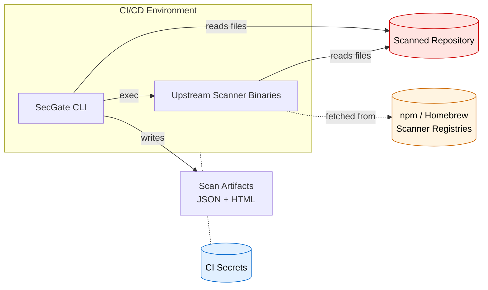
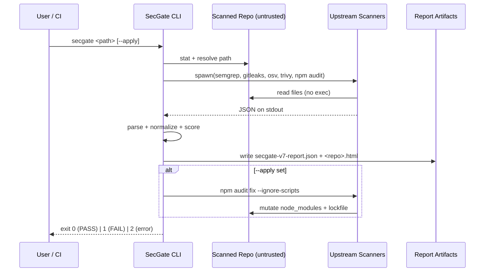

```text
░▒▓█ SECGATE · THREAT MODEL █▓▒░
```

# SecGate Threat Model

STRIDE-based threat model for SecGate.

**Audience:** security reviewers, enterprise adopters, contributors hardening the CLI.

---

## Scope

SecGate is a Node.js CLI that orchestrates upstream scanners (Semgrep, Gitleaks, npm audit, osv-scanner, Trivy) against a target directory, aggregates findings, emits JSON + HTML reports, and optionally runs `npm audit fix`.

This document covers the CLI and its immediate runtime context. It does **not** cover vulnerabilities in upstream scanners themselves (report those upstream).

---

## Trust Boundaries

Four distinct trust zones — each with different adversary assumptions.



| Zone | Trust level | Controlled by |
|------|-------------|---------------|
| SecGate CLI process | Trusted (this repo) | TinyDarkForge |
| Upstream scanner binaries | Semi-trusted (signed releases, pinned versions) | Semgrep, GitGuardian, Google, Aqua, npm |
| Scanned repository contents | **Untrusted** (can be adversarial) | End user / customer / PR author |
| CI environment | Trusted (customer-owned, but holds secrets) | End user |

**Key invariant:** code under the scanned repository path is data, not instructions. SecGate must never execute, `require()`, or `source` anything from the scanned target.

---

## Assets

Ranked by blast radius.

1. **CI secrets** (`GITHUB_TOKEN`, registry tokens, cloud creds) — present in the CI env. Exfiltration is the highest-impact outcome.
2. **Source code in scanned repo** — may contain unpushed IP, unredacted secrets, customer data.
3. **Scan artifacts** (`secgate-v7-report.json`, `<repo>.html`) — contain finding metadata, file paths, rule IDs. Can leak structural info if uploaded publicly.
4. **SecGate process integrity** — compromised output = compromised gate = silent pass on real vulnerabilities.
5. **Host filesystem outside target** — path traversal could read arbitrary files.

---

## Threat Actors

| Actor | Capability | Likelihood |
|-------|-----------|-----------|
| **Malicious scanned repo** — attacker submits PR with hostile code / lifecycle scripts / crafted filenames | Arbitrary file contents, arbitrary `package.json` scripts, symlinks | **High** — primary attack surface for any hosted CI scanner |
| **Compromised scanner binary** — upstream registry hijack, supply-chain attack on Semgrep/Trivy/etc. | Code exec at SecGate's privilege level | Low-Medium — historical precedent exists |
| **Malicious CI workflow** — attacker with write access to `.github/workflows/` invokes SecGate with hostile flags | Full CI env access already; SecGate is not the primary control | Medium — out of scope (customer-owned) |
| **Local dev with malicious config** — hostile `.secgaterc` or similar future config file | Depends on config surface (see #32) | Medium — mitigated by not executing config |

---

## STRIDE Analysis

### S — Spoofing

| Threat | Mitigation |
|--------|-----------|
| Attacker substitutes a fake scanner binary on `$PATH` | Document pinning via Homebrew/apt checksums; recommend `npx --package=<pinned>` in CI; future: verify signed releases (see #29) |
| Forged HTML report uploaded as "SecGate output" | Reports are advisory, not authoritative. Real CI gate is exit code from SecGate process run on fresh artifacts |

### T — Tampering

| Threat | Mitigation |
|--------|-----------|
| Scanned repo includes `package.json` with malicious `preinstall`/`postinstall` | `--ignore-scripts` passed to `npm audit` (see #29). SecGate never runs `npm install` against target |
| Symlink in scanned repo points outside target to exfil creds | `--strip-paths` normalizes all reported paths; scanner binaries inherit symlink handling from their own policies. Document: run in container with bind-mount read-only |
| Attacker modifies `secgate-v7-report.json` between runs | Filename is predictable; CI artifact upload uses run-scoped storage. Do not trust reports from across runs |
| Scanner binary tampered in-place | Future: verify SBOM + signatures (see #29). Today: rely on package-manager integrity |

### R — Repudiation

| Threat | Mitigation |
|--------|-----------|
| Developer claims SecGate "passed" on a release that shipped vuln | JSON report is deterministic and CI-archived. Timestamp + version + mode are in every report |
| No audit trail for `--apply` runs | `remediation.executed[]` records each executed fix. Document: require code review of `--apply` diffs before merge |

### I — Information Disclosure

| Threat | Mitigation |
|--------|-----------|
| Report uploaded publicly leaks internal file paths | `--strip-paths` (see #29) replaces absolute paths with repo-relative |
| Gitleaks output echoes live secrets to stdout/logs | Gitleaks redaction is upstream; SecGate does not re-log raw match bodies. HTML report masks secret values |
| CI logs expose SecGate verbose output containing rule context | `--debug` is opt-in only. Default output is summary-level |

### D — Denial of Service

| Threat | Mitigation |
|--------|-----------|
| Scanned repo contains ReDoS-triggering pattern that hangs Semgrep | Upstream scanner timeouts apply. Document: CI-level job timeout as belt-and-braces |
| Giant binary blobs inflate scan runtime | Semgrep/Trivy skip binaries by default. `.gitleaksignore` respected |
| Fork bomb via malicious scanner substitute | Covered by Spoofing mitigations (pinning) |

### E — Elevation of Privilege

| Threat | Mitigation |
|--------|-----------|
| Command injection via crafted filename passed to scanner | SecGate uses `spawn()` with argument arrays, never shell strings. All user-supplied paths are passed as single `argv[]` entries |
| Path traversal in target argument (`secgate ../../etc`) | Target is resolved to absolute path and used as-is; scanner binaries operate within their own path policies. Document: run SecGate as non-root |
| `--apply` runs `npm audit fix` which executes lifecycle scripts on fix install | `npm audit fix --ignore-scripts` (see #29). Dry-run is default (see ADR-0003) |

---

## Data Flow



---

## Mitigations Summary

Cross-referenced with epic **#29 (hardening epic)**.

| Mitigation | Status | Reference |
|-----------|--------|-----------|
| `--ignore-scripts` on all npm operations | Planned | #29 |
| `--strip-paths` flag to remove absolute paths from reports | Planned | #29 |
| SBOM publication alongside npm releases | Planned | #29 |
| Signed release binaries + provenance | **Shipped** (npm provenance) | README |
| Argument-array `spawn()` (no shell) | **Shipped** | `secgate.js` |
| Dry-run default for remediation | **Shipped** | ADR-0003 |
| Config file execution prohibited | Planned | #32 |
| Scanner version pinning guide | Planned | `docs/tuning.md` |

---

## Out of Scope

- Vulnerabilities in Semgrep/Gitleaks/osv-scanner/Trivy/npm themselves — report upstream.
- Customer CI environment misconfiguration.
- End-user remediation decisions (false-positive acceptance is a user responsibility).

---

## Revision history

| Date | Change |
|------|--------|
| 2026-04-23 | Initial publication |

See also: [`coverage.md`](coverage.md), [`tuning.md`](tuning.md), [`adr/`](adr/), [`../SECURITY.md`](../SECURITY.md).
